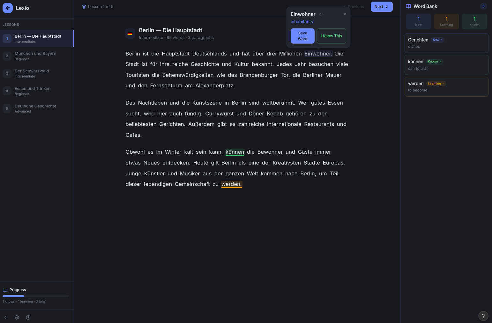
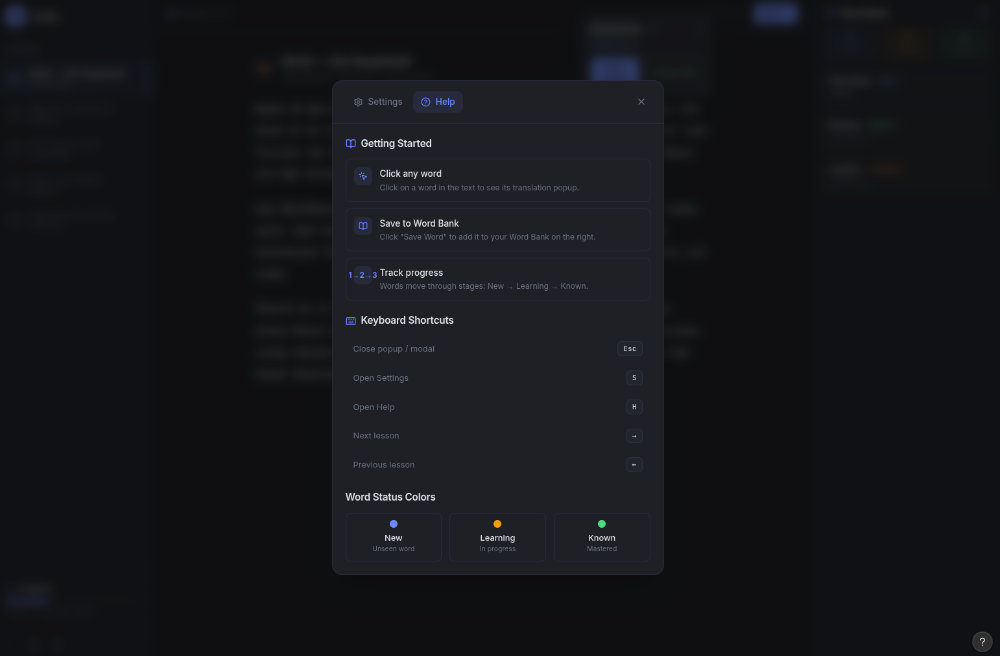
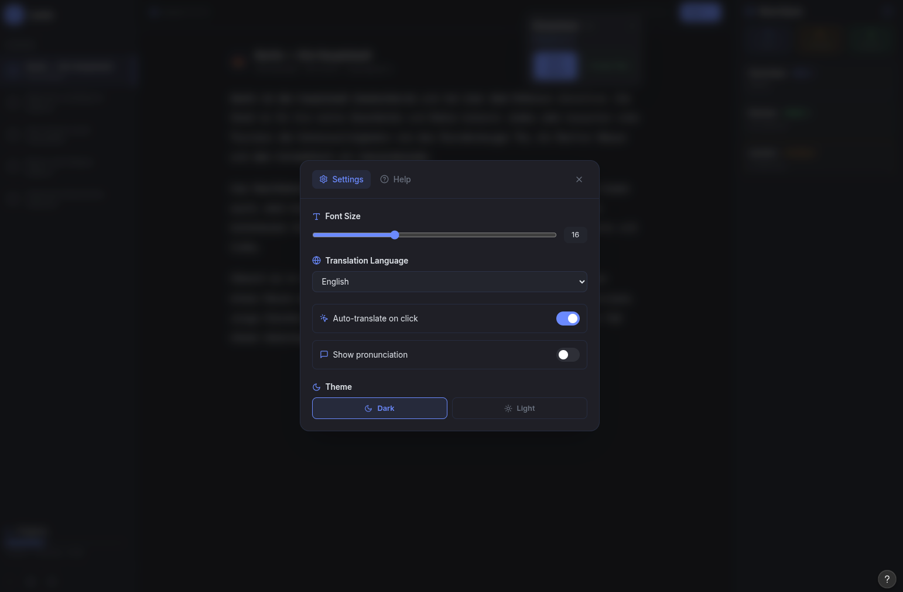

# Lexio

Read foreign-language books and translate any word instantly with a click.

## Screenshots

> UI designed in Figma





## Stack

- **Frontend** — Vue 3 + Vite + Tailwind CSS
- **Backend** — Rust + Axum
- **Translation** — DeepL API
- **Books** — Project Gutenberg via Gutendex

## Development

```bash
# Backend
cd backend
cp .env.example .env  # add your DEEPL_API_KEY
cargo run

# Frontend
cd frontend
npm install
npm run dev
```

## Deployment

- Frontend → Vercel (set `VITE_API_BASE` env var to backend URL)
- Backend → Render (set `DEEPL_API_KEY` env var)
